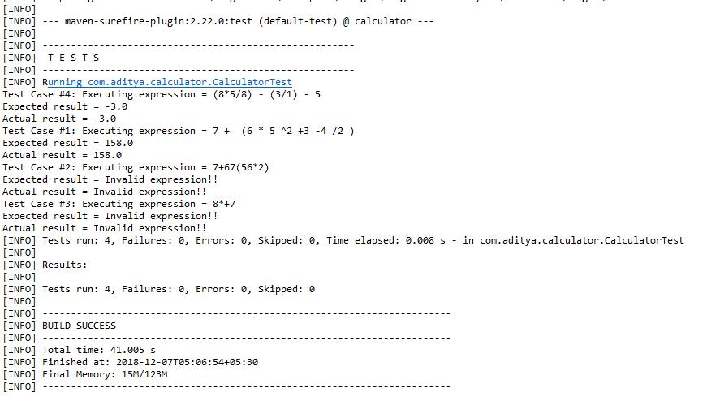
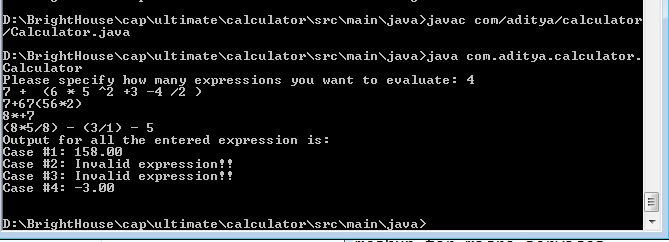

# Calculator sample using Java with Maven

## Introduction

The mathematical calculator allows you to enter the whole mathematical expression as a sequence of consecutive operands and operators. Operators can be +, -, /, *, ^ (power), (, ) and operands can be number between 0-9. A sample mathematical expression will look as 7 + (6 * 5^2 + 3-4/2). A mathematical expression cannot start or end with a operator with only exception for ( (expression can start but cannot end) and ) (expression can end but cannot start). Every opening brace ( must have a corresponding closing brace ) . An operand cannot have its adjacent as a operator except for ( i.e (( and ) i.e )). Maximum 100 expressions can be evaluated in a single run. 

## Assumptions
-   Decimal inputs are not allowed whereas output could have upto 2 places of decimal.
-   Empty expression is considered as invalid expression.
-   Operator precedence uses BODMAS rule.
-   
## Libraries/tools 
-   Java JDK 1.8.0_101 (Used Stream APIs, Lambda function and forEach of Java 8)
-   Apache Maven 3.6.0
-   JUnit 5.3.1
-   
## How to build/run the application
### Prerequisites
Following softwares must be installed before execution 
-   Java JDK 1.8.0_101 
-   Maven 3.6.0
-   Git
### Running the application
-   Clone repository to a folder, say </home>
-   Open command prompt and navigate to checkout folder </home>
-   Using Maven, run following command (make sure to have working internet connection)
    ```sh
    mvn clean test
    ```
-   If you want to run it using Java commands, navigate to folder </home>/src/main/java
-   Run following command
    ```sh
    javac com/aditya/calculator/Calculator.java
    java com.aditya.calculator.Calculator
    ```
Congratulations! You have successfully executed the application, enjoy!!

## Technical details
The application uses Stack approach to solve the mathematical expression. The model class MathExpression validates the expression before evaluating it. If the validation fails, it throws InvalidExpressionException.
Each valid expression is evaluated by tokenizing the expression into characters. Operators and Operands are separated using Stack and are evaluated based on their precedence. 
## Screenshots
### Screenshot of output after running mvn test

### Screenshot of output after running application through java command
